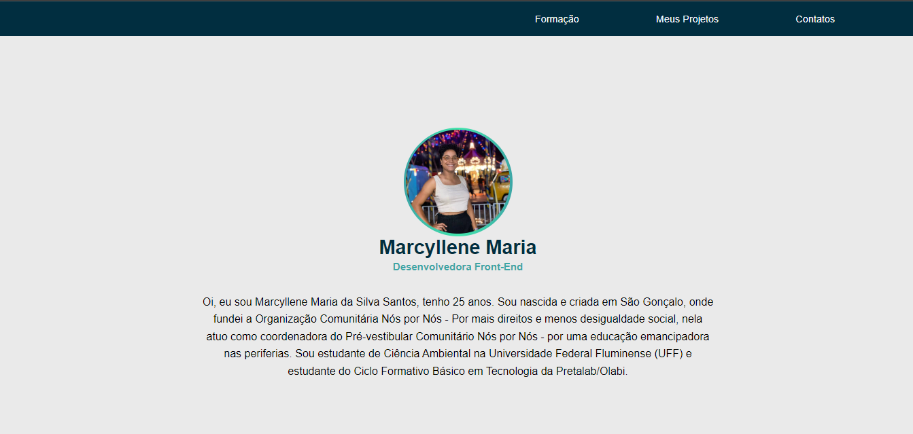

# Ciclo Formativo em Tecnologia Pretalab/Olabi

> 💻 Módulo 1 

Projeto de potfólio construído como proposta do Módulo 1 em HTML e CSS do Ciclo Formativo da Pretalab

🔗 [Clique aqui para acessar no github](https://github.com/MarcylleneMaria/portfolio-marcyllene-pretalab)

🔗 [Clique aqui para acessar o site](https://portfolio-marcyllene-maria.netlify.app/)

## 🌌 Tecnologias 

- HTML
- CSS
- Git e Github
